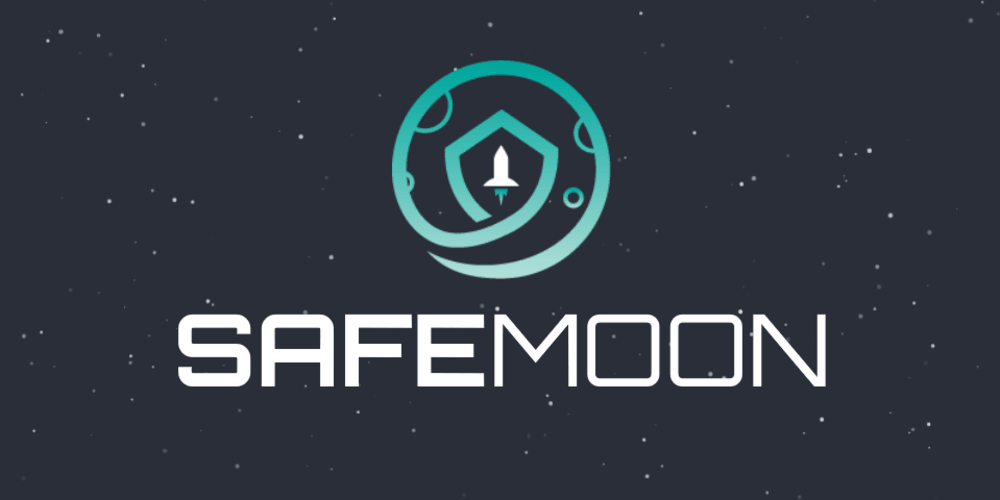

# SafeMoon Protocol

| [Reddit](https://www.reddit.com/r/SafeMoon/)| [Twitter](https://twitter.com/safemoon) |[Telegram](https://t.me/SafeMoonv2)|[Discord](https://discord.com/invite/safemoon)|
| ----------- | ----------- | ----------- | ----------- |

- **Website:** [safemoon.net](https://www.safemoon.net/)
- **Blockchain Explorer:** [Bscscan](https://www.bscscan.com/token/0x8076c74c5e3f5852037f31ff0093eeb8c8add8d3)

---

## Static Rewards, LP Acquisition, Manual Burn

The SafeMoon Protocol employs 3 simple functions: Reflection + LP acquisition + Burn In each trade, the transaction is taxed a 10% fee, which is split 2 ways.

- 5% fee = redistributed to all existing holders
- 5% fee is split 50/50 half of which is sold by the contract into BNB, while the other half of the SAFEMOON tokens are paired automatically with the previously mentioned BNB and added as a liquidity pair on Pancake Swap

## Reflection :heavy_check_mark:
Static rewards solve a host of problems. First, the reward amount is conditional upon the volume of the token being traded. This mechanism aims to alleviate some of the downward sell pressure put on the token caused by earlier adopters selling their tokens after farming crazy high APY’s. Second, the reflect mechanism encourages holders to hang onto their tokens to garner higher kick-backs which are based upon a percentages carried out and dependent upon the total tokens held by the owner.

## LP Acquisition :moneybag:
Automatic LP is the secret sauce of SAFEMOON. Here we have a function that acts as a two-fold beneficial implementation for holders. First, the contract sucks up tokens from sellers and buyers alike, and adds them to the LP creating a solid price floor. Second, the penalty acts as an arbitrage resistant mechanism that secures the volume of SAFEMOON as a reward for the holders. In theory, the added LP creates a stability from the supplied LP by adding the tax to the overall liquidity of the token, thus increasing the tokens overall LP and supporting the price floor of the token. This is different from the burn function of other reflection tokens which is only beneficial in the short term from the granted reduction of supply. As the SAFEMOON token LP increases, the price stability mirrors this function with the benefit of a solid price floor and cushion for holders. The goal here is to prevent the larger dips when whales decide to sell their tokens later in the game, which keeps the price from fluctuating as much as if there was no automatic LP function. All of this is an effort to alleviate some of the troubles we have seen with the current DeFi reflection tokens. We are confident that this model and protocol will prevail over the outdated reflection tokens for these reasons.

## Manual Burn :fire:
Sometimes burns matter; sometimes they don’t. A continuous burn on any one protocol can be nice in the early days, however, this means the burn cannot be finite or controlled in any way. Having burns controlled by the team and promoted based on achievements helps to keep the community rewarded and informed. The conditions of the manual burn and the amounts can be advertised and tracked. SafeMoon aims to implement a burn strategy that is beneficial and rewarding for those engaged for the long term. Furthermore, the total number of SAFEMOON burned is featured on our readout located on the website which allows for further transparency in identifying the current circulating supply at any given point of time.

Safemoon protocol is a mixture of RFI tokenomics with the added function of auto-liquidity generating protocol. A fork from BEE with some added benefits.
First, the dev has minted the tokens - sent the balance to DxSale for fair launch - and then burned the remainder of the tokens. Dev had to partake in presale.
Second, utilized the DxSale protocol to foster trust in the community by auto-locking liquidity for 4 years.
Simple tokenomics and elegant design and production of token information has catered to the overall success of the project.
100% community owned and driven - no rug is possible. 
#safemoon join us on our journey safely to the moon!

## Safety :star:
Step by step plan to ensure 100% safety.
- Dev burned all tokens in Dev Wallet prior to launch
- Fair launch on [DxSale](https://dxsale.network/)
- LP locked on [DxLocker](https://dxsale.network/) for 4 years
- LP generated with every trade and locked on [Pancakeswap](https://pancakeswap.finance/)
